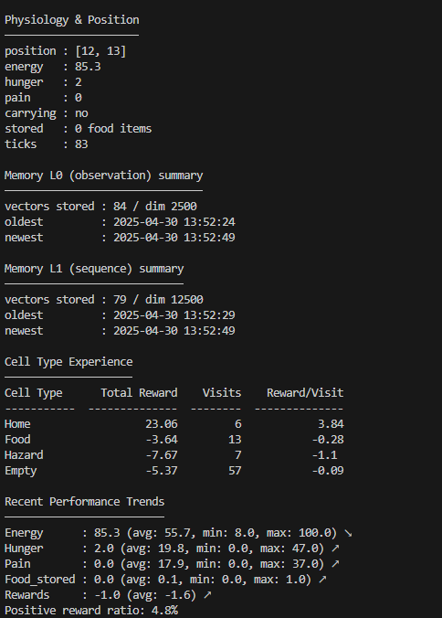

# Hop To It: Multi-Agent Emergent Communication in Grid World

## Overview

This project implements autonomous agents that navigate a grid-based world using neural networks for communication and experience-based learning for decision-making. Agents balance exploration, resource gathering, self-preservation, and social interaction while adapting to their environment through reinforcement learning rather than hardcoded rules.


## Features

- **Neural-Based Emergent Communication**: Agents develop their own signaling patterns using neural networks without predefined protocols
- **Social Interactions**: Agents can share resources, form groups, and learn from observing each other
- **Experience-Based Learning**: Agents learn to avoid hazards and seek rewards through experience rather than hardcoded rules
- **Reinforcement Learning**: Uses Q-learning to update agents' understanding of their environment
- **Persistent Memory**: Agents save their neural networks, learning experiences, and physiological state between runs
- **Fatigue-Aware**: Agents consider energy, hunger, and pain in their decision-making with exponential penalties for critical states
- **Exploratory Behavior**: Uses surprise from Hopfield networks and epsilon-greedy exploration to encourage discovery
- **Enhanced Home Benefits**: Special recovery mechanics when resting at home provide adaptive safe-haven behavior
- **Population Dynamics**: Agents can reproduce when resources are abundant and die when resources are depleted
- **Interactive Visualization**: Streamlit interface with real-time metrics and population statistics

## Technical Architecture

### Communication System

The agents implement a neural-network based communication system:

1. **Signal Encoding**: Neural networks convert agent state into signals
   ```python
   class SignalEncoder(nn.Module):
       def __init__(self, state_dim=10, hidden_dim=20, signal_dim=5):
           super(SignalEncoder, self).__init__()
           self.fc1 = nn.Linear(state_dim, hidden_dim)
           self.fc2 = nn.Linear(hidden_dim, signal_dim)
   ```

2. **Signal Decoding**: Neural networks interpret received signals
   ```python
   class SignalDecoder(nn.Module):
       def __init__(self, signal_dim=5, hidden_dim=20, output_dim=3):
           super(SignalDecoder, self).__init__()
           self.fc1 = nn.Linear(signal_dim, hidden_dim)
           self.fc2 = nn.Linear(hidden_dim, output_dim)
   ```

3. **Signal Learning**: Agents learn to associate signals with outcomes
   ```python
   def train_decoder(self, agent_id, batch_size=8):
       # Train decoder network to predict meaning/value of signals
       # Target categories: beneficial, harmful, neutral
   ```

4. **Observational Learning**: Agents can learn from watching other agents
   ```python
   def learn_from_observation(self, observer_id, observed_id):
       # Learn from observing another agent's signals and outcomes
   ```

### Social Interaction System

The agents can engage in various social interactions:

1. **Food Sharing**: Agents can share food with hungry neighbors
   ```python
   def resolve_agent_interaction(self, agent1, agent2):
       # Check if food sharing is possible
       if agent1.carrying and agent2.hunger > MAX_H * 0.7:
           # Agent1 shares food with agent2
   ```

2. **Population Management**: Tracks births and deaths in the population
   ```python
   def handle_population_changes(self):
       # Handle agent reproduction and death
       # Find agents with enough resources to reproduce
       viable_parents = [agent for agent in self.agents.values() 
                       if agent.energy > MAX_E * 0.7 and 
                          agent.store > 2]
   ```

### Learning System

The agents implement a multi-layered learning approach:

1. **Experience Memory**: Tracks rewards associated with different cell types
   ```python
   self.cell_experience = {
       "home": {"reward": 0, "visits": 0, "last_visit": 0},
       "food": {"reward": 0, "visits": 0, "last_visit": 0},
       "hazard": {"reward": 0, "visits": 0, "last_visit": 0},
       "empty": {"reward": 0, "visits": 0, "last_visit": 0}
   }
   ```

2. **Q-Learning**: Maintains state-action values that are updated using:
   ```python
   new_q = old_q + LEARNING_RATE * (reward + DISCOUNT_FACTOR * next_max_q - old_q)
   ```

3. **Exploration Strategy**: Uses epsilon-greedy approach that decreases over time:
   ```python
   epsilon = max(0.1, 1.0 / (1 + self.tick_count / 1000))
   ```

4. **Exponential Reward System**: Creates stronger learning signals for critical states:
   ```python
   energy_penalty = -10.0 * energy_critical * energy_critical if energy_critical > 0.5 else 0
   ```

### Agent Decision-Making

The agents use a sophisticated planning system that combines learned values with heuristics:

1. Considers all possible moves (North, South, East, West, or Rest)
2. Calculates a value for each action based on:
   - Q-values from past experience
   - Experience-based rewards for different cell types
   - Exploration bonuses for less-visited cell types
   - Memory-based surprise from Hopfield networks
   - Current physiological needs (hunger, pain, energy)
   - Goal-directed behavior (returning home when carrying food or low on energy)
   - Social signals from other agents
3. Selects the highest-value action
4. Updates learning based on observed outcomes

### Neural Foundations: Hopfield Networks

At the core of the agents' memory are two Hopfield networks:

- **Primary Memory (mem0)**: Stores observations of the immediate environment
- **Sequential Memory (mem1)**: Stores sequences of observations to capture temporal patterns

These networks implement a modern continuous Hopfield network with a softmax-based update rule:

```python
logits = self.M @ y - (self.M @ y).max()
p = np.exp(logits)
y = (p / s) @ self.M
```

This approach allows for a form of content-addressable memory that drives the agents' curiosity and novelty detection.

## Implementation Details

- **Grid Representation**: 25×25 grid with color-coded cell types (home, food, hazard, empty)
- **One-Hot Encoding**: Converts categorical cell types to vector representation
- **Multi-Agent Management**: Population class that handles agent interactions
- **Neural Communication**: Pytorch-based neural networks for signal encoding/decoding
- **Streamlit Interface**: Advanced visualization with metrics, history charts, and interactive controls
- **Numpy-based Persistence**: Compressed storage of agent memory, learning, and state
- **Analytics Tools**: Standalone analyzer script for investigating agent learning patterns

## Usage

### Running the Simulation

```bash
streamlit run main.py
```

### Control Options
- **Start/Pause**: Begin or pause the simulation
- **Speed Slider**: Adjust simulation speed
- **Reset**: Clear state and reinitialize the world
- **Add/Remove Agent**: Modify the population size
- **Select Agent**: Choose an agent to monitor in detail

### Analyzing Agent State

Use the agent state viewer to analyze learning progress:

```bash
python agent_state_viewer.py                # Basic view
python agent_state_viewer.py --learning     # Detailed learning analysis 
python agent_state_viewer.py --plot         # Visualize memory patterns
python agent_state_viewer.py --export       # Export data for further analysis
```



## Project Structure

```
.
├── main.py                # Main application entry point
├── module_agent.py        # Agent and population management
├── module_hopfield.py     # Hopfield network implementation
├── module_world.py        # World environment
├── module_coms.py         # Neural communication system
├── agent_state_viewer.py  # Analysis tool for inspecting agent state
├── agent_state.npz        # Persisted agent state (created at runtime)
└── README.md              # This documentation file
```

## Future Work

Potential extensions:
- Cultural transmission of learned behaviors across generations
- Specialized agent roles within social groups
- Territory claiming and defense behaviors
- Cooperative problem-solving requiring coordination
- More complex communication for planning and intentionality
- Reputation systems and trust-based interactions
- Environmental pressures that require group adaptation
```
