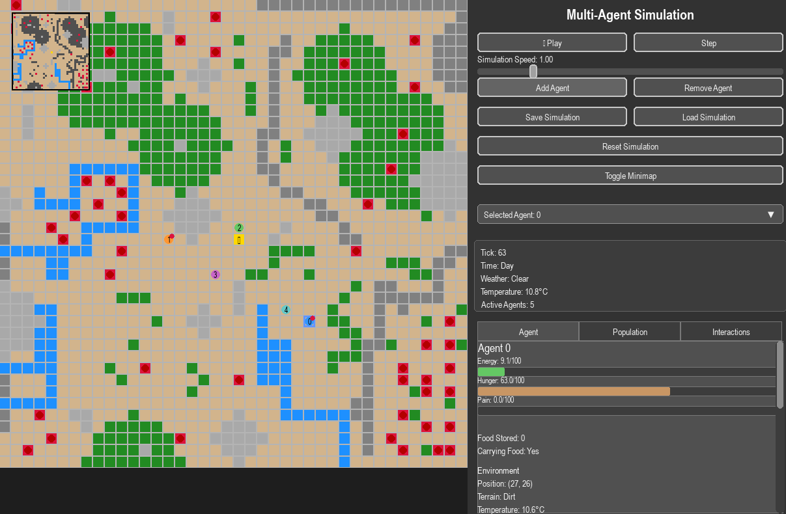

# Multi-Agent Emergence Simulation

This simulation demonstrates emergent behavior and communication patterns between multiple autonomous agents in a complex environment. Agents learn and adapt over time, developing their own strategies for survival and cooperation without hard-coded behaviors.



## Features

- **Complex Terrain-Based World**: Agents navigate a world with various terrain types (dirt, water, stone, etc.) each with unique properties like friction, temperature, and passability.
- **Adaptive Agent Behavior**: Agents learn from their environment using Q-learning and Hopfield networks, developing individual strategies for survival.
- **Neural Communication**: Agents can communicate with each other by broadcasting signals that are learned and interpreted through neural networks.
- **Emergent Social Behavior**: Agents may develop emergent social patterns like food sharing without being explicitly programmed to do so.
- **Dynamic Environment**: Weather systems and day/night cycles affect agent behavior and terrain properties.
- **Interactive Visualization**: Real-time visualization of the simulation with detailed agent statistics and world information.

## Requirements

- Python 3.6+
- Pygame
- NumPy
- Matplotlib (for visualizations)
- PyTorch (optional, for neural communication features)

## Installation

1. Clone this repository:
```bash
git clone https://github.com/yourusername/multi-agent-emergence.git
cd multi-agent-emergence
```

2. Install the required packages:
```bash
pip install pygame numpy matplotlib torch
```

## Usage

Run the simulation with:

```bash
python main_pygame.py
```

### Command Line Options

- `--load [FILENAME]`: Load a saved simulation state

### Controls

- **Space**: Pause/resume simulation
- **Right Arrow**: Step forward one tick when paused
- **Click on Agent**: Select agent to view detailed statistics
- **UI Buttons**:
  - Play/Pause: Toggle simulation running state
  - Step: Advance simulation by one tick
  - Speed Slider: Adjust simulation speed
  - Add Agent: Add a new agent to the world
  - Remove Agent: Remove the currently selected agent
  - Save/Load: Save or load simulation state
  - Reset: Reset the simulation to a fresh state

## How It Works

### World Model

The terrain system uses `TerrainCell` objects to represent each cell in the grid world, with properties including:
- Material type (dirt, stone, water, etc.)
- Physical properties (hardness, density, friction)
- Temperature and thermal conductivity
- Passability and risk factors

The world also models weather patterns and day/night cycles that affect both terrain and agent behavior.

### Agent Architecture

Each agent has:
- **Physical Properties**: Energy, hunger, pain, and inventory
- **Perception**: Agents observe their local environment to make decisions
- **Memory Systems**:
  - Episodic memories via Hopfield networks
  - Q-learning for reinforcement learning
  - Experience tracking for different terrain types
- **Neural Communication**: Agents use encoder/decoder neural networks to broadcast and interpret signals

### Emergent Behavior

The simulation focuses on minimizing hard-coded behaviors, instead letting strategies and social patterns emerge from basic reinforcement learning and environmental pressures.

Some emergent behaviors you might observe:
- Food gathering and storage
- Shelter-seeking during adverse weather
- Communication about food locations or dangers
- Social bonds and sharing behaviors
- Territory formation and defense

## Extending the Simulation

You can customize various aspects of the simulation:
- Edit terrain generation in the `World` class
- Modify agent learning parameters in the `Agent` class
- Add new materials and terrain types
- Design new weather patterns and environmental effects
- Add new agent capabilities or communication mechanisms

## License

This project is licensed under the MIT License - see the LICENSE file for details.

## Acknowledgments

- Built using Pygame for visualization
- Neural networks implemented with PyTorch
- Inspired by research on multi-agent systems, emergent communication, and reinforcement learning
