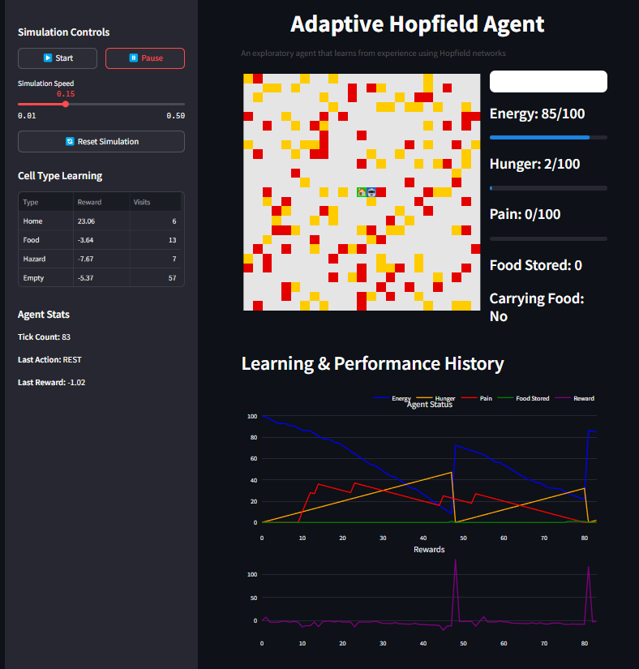
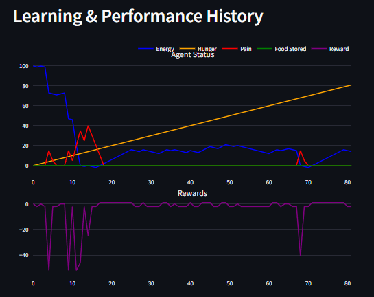

# Hop to it: Agentic A* Planing and Modern Hopfield Memory

A lightweight multi-agent simulation framework powered by Modern Hopfield memory, A\* planning, and discrete communication. Agents explore a grid world, learn from their experiences (including path outcomes), and exchange symbolic messages on demand.



---

## Introduction

This framework simulates autonomous agents in a grid-based world. Each agent:

* **Perceives** its local environment and encodes observations into a continuous Modern Hopfield memory (`mem0`) for surprise detection.
* **Plans** optimal routes to goals (home or known food) using A\* pathfinding, avoiding learned hazards.
* **Simulates** full path outcomes (energy spent, hunger/pain incurred, food collected) before executing a step.
* **Stores** each path + outcome vector in a secondary Hopfield memory (`mem_paths`) for episodic recall.
* **Learns** action policies via Q-learning with state-action values, tempered by physiological drives (energy, hunger, pain).
* **Communicates** symbolic summaries of high-reward or high-surprise experiences via on-demand queries.



---

## Architecture

* **World (`module_world.py`)**

  * 25×25 grid of cells: `home`, `food`, `hazard`, `empty`.
  * Deterministic placement of 80 food and 70 hazards (via fixed RNG).
  * Persistence of world state across runs.

* **Agent (`module_agent.py`)**

  1. **Observation & Surprise**

     * One-hot encoding of entire grid, stored in `mem0`.
     * Surprise = Euclidean distance between current obs and recalled pattern.
  2. **A* Planning*\*

     * Maintains a `known_map` of stepped-on cells (`home`, `food`, `hazard`, `empty`).
     * Computes A\* routes to home (when carrying food or low energy) or nearest known food.
     * Blocks moves into learned hazard cells; treats unknown cells as walkable.
  3. **Path Simulation & Episodic Memory**

     * Simulates the full planned path to estimate energy use, hunger/pain changes, and food gains.
     * Vectorizes path coordinates + outcome metrics and stores in `mem_paths`.
  4. **Action Execution & Physiology**

     * Applies move or rest, updates energy, hunger, pain, pickup/deliver logic.
     * Computes reward based on physiological deltas and task events.
  5. **Learning**

     * Updates Q-values (state-action) using reward and discount.
     * Updates per-cell experience statistics to bias future planning.
     * Stores sequences of observations + reward in `mem1` for communication.
  6. **Persistence**

     * Saves/loads all memories (`mem0`, `mem1`, `mem_paths`), Q-values, experiences, physiology, and `known_map` to `.npz` files.

* **Hopfield (`module_hopfield.py`)**

  * Continuous modern Hopfield network supporting variable-dimension vectors (observations, sequences, path outcomes).
  * Softmax-based attention recall (Ramsauer et al. 2020) and surprise computation.

* **Communication (`module_comm.py`)**

  * Broadcast bus for query-response among agents.
  * Vector-quantization placeholder (`VQ`) for clustering episodic segments into symbols.

* **Dashboard (`main.py`)**

  * Streamlit app with:

    * **Comparative metrics** table: food collected, average reward, hazards learned, steps taken.
    * **World grid** visualization with agent overlays.
    * **Agent status** (energy, hunger, pain, carrying state) side-by-side.
    * **Performance charts**: energy and reward over ticks for each agent.
    * **Controls**: start/pause/reset and simulation speed slider.

---

## Installation

```bash
git clone https://github.com/yourusername/hopfield-auto-agent.git
cd hopfield-auto-agent
pip install -r requirements.txt
```

---

## Usage

Run the interactive dashboard:

```bash
streamlit run main.py
```

Explore the simulation, adjust speed, and compare agent performance in real time.

---

## Configuration

Key parameters live at the top of `module_agent.py` and `main.py`:

* **Grid size**: `GRID`
* **Memory capacities**: `CAP_L0`, `CAP_L1`, `CAP_PATH`
* **Physiology**: `MAX_E`, `HUNGER_W`, `PAIN_W`, `FOOD_E`, `PAIN_HIT`, etc.
* **A* weights*\*: implicit unit costs; unknown/hazard tuning in `a_star`.
* **Learning rates**: `LEARNING_RATE`, `DISCOUNT_FACTOR`, `EXPERIENCE_DECAY`

Modify these before launching the app.

---

## License

This project is released under the MIT License. See [LICENSE](LICENSE) for details.
