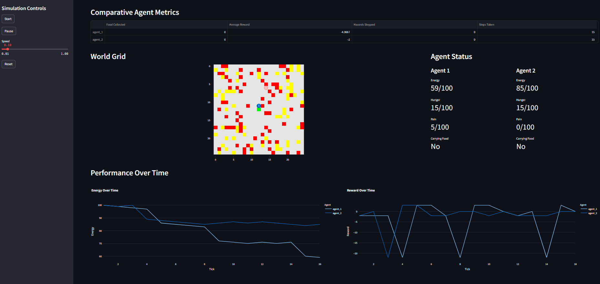

# Hop to it: Modern Hopfield Auto‑Agent

A lightweight multi‑agent simulation framework powered by Modern Hopfield memory and discrete communication. Agents explore a grid world, learn from their experiences, and exchange symbolic messages on demand.



---

## Introduction

This framework simulates autonomous agents in a grid-based world. Each agent uses a Modern Hopfield network to store and recall sensory observations, applies simple reinforcement signals to learn policies, and communicates with peers only in response to queries.

### Key concepts:

* **Associative Memory:** Modern Hopfield networks retain patterns of past observations for rapid recall.
* **Reinforcement Learning:** Agents receive rewards based on energy, hunger, and task outcomes.


* **On‑Demand Communication:** Agents query neighbors and reply with symbolic summaries of their latest experiences.

---

## Architecture

* **World:** Provides cell types (`home`, `food`, `hazard`, `empty`), tracks agent positions, and applies interactions.
* **Agent Loop:** On each tick, agents observe their surroundings, update memory, choose actions, and optionally exchange messages when queried.
* **Communication Bus:** A simple message channel for broadcasting queries and responses between agents.

---

## Modules

* **`main.py`**: Initializes the world and agents, starts the simulation loop, and handles logging.
* **`module_world.py`**: Defines the `World` class with grid initialization, cell management, and time stepping.
* **`module_hopfield.py`**: Implements a Modern Hopfield associative memory with storage and surprise detection.
* **`module_comm.py`**: Manages a vector‑quantization codebook, message registration, and the communication API.
* **`module_agent.py`**: Contains the `Agent` class, including perception, learning, action selection, and query‑response handlers.

---

## Installation

1. Clone the repository:

   ```bash
   git clone https://github.com/yourusername/hopfield-auto-agent.git
   cd hopfield-auto-agent
   ```

2. Install dependencies:

   ```bash
   pip install -r requirements.txt
   ```

---

## Usage

Start the simulation with Streamlit:

```bash
streamlit run main.py
```

By default, the simulation opens in a browser window showing:

* Real‑time agent positions on the grid
* Memory surprise and reward charts
* A control panel for hyperparameters

---

## Configuration

All key parameters live in `module_agent.py` and `main.py`:

**Examples:**

* **Grid size**: `GRID` (default: 25)
* **Memory capacities**: `CAP_L0`, `CAP_L1`
* **Communication symbols**: `N_SYMBOLS`
* **Agent physiology**: `MAX_E`, `MOVE_COST`, `FOOD_E`, etc.
* **Learning rates**: `LEARNING_RATE`, `DISCOUNT_FACTOR`

Adjust these constants at the top of each file before running the simulation.

---

## License

This project is released under the MIT License. See [LICENSE](LICENSE) for details.
